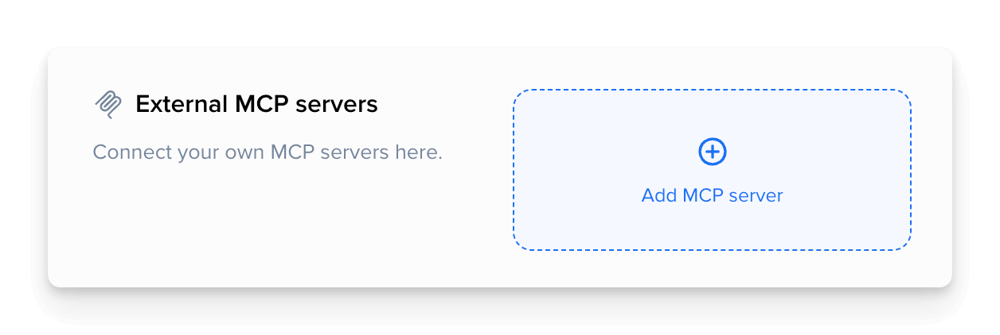
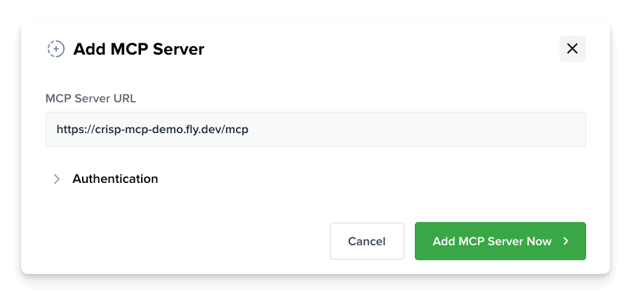
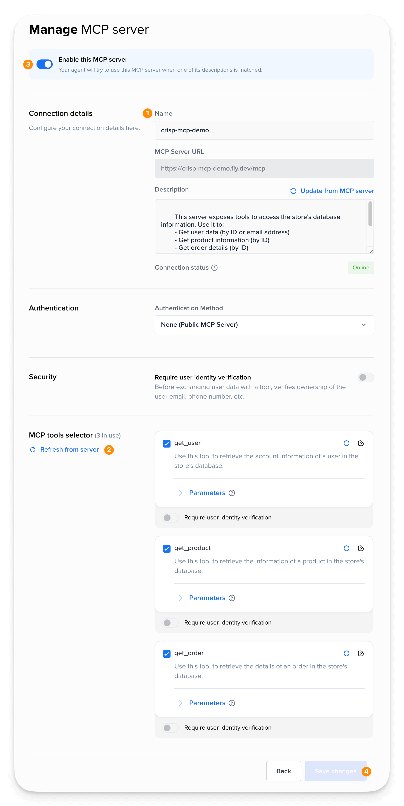
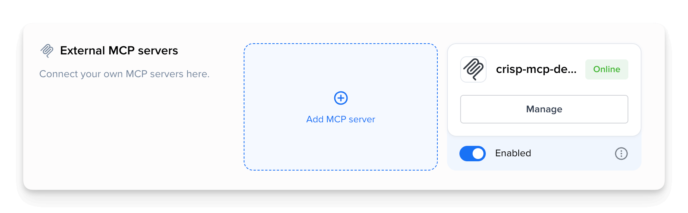

# Crisp MCP Demo Server

**Demo MCP (Model Context Protocol) server to showcase how to build and use MCP with Crisp.**

This repository serves as a reference implementation for developers looking to experiment with MCP. It is ready to be deployed, tested, or built upon.

It exposes a MCP endpoint with three tools backed by mock-up data:

- `get_user` → get a user by `email`
- `get_order` → get an order by `id`
- `get_product` → get a product by `id`

_This demo is built using the [@modelcontextprotocol Typescript SDK](https://github.com/modelcontextprotocol/typescript-sdk). Visit their repo for more details and documentation on MCP._

## I. Installing & Running

_To get started with this MCP server, you can either run it locally or use the hosted version._

### Using the hosted version

This MCP server comes already hosted at and ready to be connected to your Crisp workspace if you wish to test it out quickly.
You can access it at: https://crisp-mcp-demo.fly.dev/mcp

### Running locally

#### Pre-requisites:

- Node.js `24.x` installed
- npm (comes with Node.js)
- a keyboard (optional, but recommended)

#### Step 1 — Cloning the repo

Open a terminal in your desired folder and run:

```sh
git clone https://github.com/crisp-im/crisp-mcp-demo.git
cd crisp-mcp-demo
```

#### Step 2 — Running the server

_You can either build and start the server, or run it directly in dev mode._

To build and run the server, use:

```sh
npm ci
npm run build
npm run start
```

Or to run it in dev mode with tsx (watch mode), use:

```sh
npm ci
npm run dev
```

#### Step 3 — Exposing the server (if running locally)

_If you wish to run the server locally, you will need to expose it through a tunnel
so that Crisp can reach it.
This package is pre-configured to use Cloudflared, though you can use any tunneling solution you prefer._

If Cloudflared is not yet installed on your machine, [follow this link](https://developers.cloudflare.com/cloudflare-one/networks/connectors/cloudflare-tunnel/downloads/) to find the installation instructions for your OS:

Once installed, open a new terminal and run:

```sh
npm run tunnel
```

You can visit your tunnel's url to confirm it's working. You should see a greeting message.

#### Available scripts

- `npm run dev` → dev server (watch)
- `npm run build` → compile TypeScript
- `npm run start` → run compiled server
- `npm run tunnel` → expose localhost via Cloudflare Tunnel
- `npm run inspect` → runs the @modelcontextprotocol Inspector

## II. Connecting to Crisp

_This section is a quickstart guide to connect this MCP server to your Crisp workspace.
We recommend also checking out [our official documentation](https://docs.crisp.chat/) for more detailed instructions._

#### Pre-requisites:

- a Crisp account
- a Crisp workspace on Essentials or Plus plan

#### Step 1 — Navigate to [app.crisp.chat](https://app.crisp.chat/)

#### Step 2 — In the **Automations** menu, head over to **Integrations & MCP** → **External MCP servers** and click on **Add MCP server**



#### Step 3 — Enter your MCP server's URL (either your hosted/tunneled URL our [hosted version](https://crisp-mcp-demo.fly.dev/mcp)) and hit **Add MCP Server Now**.



#### Step 4 — Configure the MCP server:

1. Name it
2. Hit **Refresh tools from server** to perform an initial fetch
3. Enable the MCP server
4. Hit the **Save MCP Server Options** button



#### Step 5 — Your MCP server should now be registered and ready to use!



## III. Testing the MCP server

_Still in the **Automations** menu, you can go to **Playground** to test your MCP server and different AI models. Ask it a question!_

### Playground examples

#### One-shot questions:

> Could you check if the refund of my order `OID_002` has been processed?

> Hi, are the notifications enabled on my account `baptiste@acme.com`?

#### The AI can chain multiple tool calls (eg. find your accunt, list recent orders and get product details):

> Are the items of my order `OID_001` still under warranty?

> When will my latest order be delivered? I'm `chris@acme.com`

#### Also try partial questions, and let the AI request additional information from you:

> What was the amount of my last order?

> I can't find my tracking number, can you help me?

### Available accounts & orders

- chris@acme.com
    - `OID_003`
    - `OID_006`
- baptiste@acme.com
    - `OID_001`
    - `OID_004`
- dinis@acme.com
    - `OID_002`
    - `OID_005`
    - `OID_007`

## MCP good practices

### MCP Design

- **Server description:** Describe the general purpose of the MCP server
- **Tool naming:** use clear and explicit names (e.g. `get_order`, not `orderLookup`)
- **Tool descriptions:** Concisely describe what the tool does, when to call it,
  and optionally provide use-case examples
- **Schemas:** Provide precise schemas for tool inputs to ensure correct usage

### User Verification

In your MCP server configuration, you can also optionally require users to authenticate themselves
before the AI can call a MCP tool. This reinforces security over sensitive operations.

If the user is not alredy authenticated, Crisp will send them an OTP code via email or SMS
before allowing the AI to call your MCP tool.

### Server Authentication

In production, you may want to restrict the access to your MCP server and prevent unauthorized usage.
Two authentication methods are available:

- **Bearer Token:** a static token sent in the `Authorization` header of each request
- **Basic Auth:** a username and password sent in the `Authorization` header of each request
